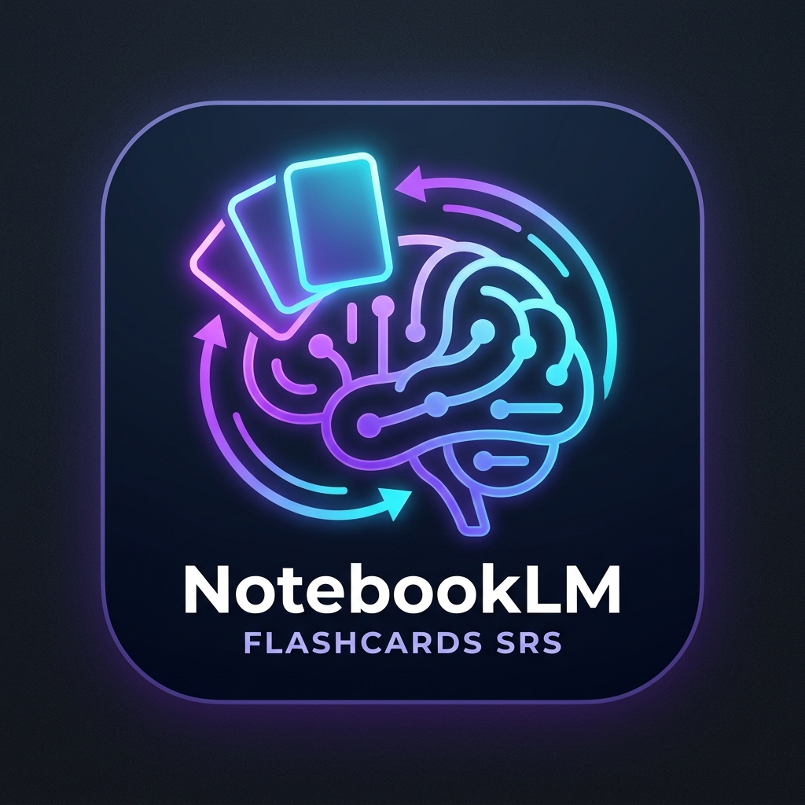

# NotebookLM Flashcards SRS

  

Solution complète de répétition espacée (Spaced Repetition System - SRS) basée sur l'algorithme FSRS v4/v5 pour exploiter les flashcards exportées depuis NotebookLM.

## Architecture

- `obsidian-plugin/` : Plugin Obsidian en TypeScript avec import CSV, génération de notes Markdown de consultation non-éditables, vue de révision interactive avec rendu LaTeX et synchronisation JSON atomique.
- `android-app/` : Application mobile Android native en Jetpack Compose pour révisions ultra-rapides.

## Directives d'utilisation du Plugin Obsidian

1. Exporter vos cartes mémoire au format CSV depuis NotebookLM.
2. Dans Obsidian, utiliser la commande `Importer un fichier CSV NotebookLM`.
3. Le plugin génère une note Markdown de consultation et met à jour `flashcards-srs-data.json`.
4. Lancer une session de révision via l'icône de ruban ou la commande `Démarrer la session de révision`.

## Build & Release CI/CD

- **GitHub Repository**: [hjamet/notebooklm-flashcards-srs](https://github.com/hjamet/notebooklm-flashcards-srs)
- Les builds et pré-publications automatisés sont compilés via GitHub Actions à chaque commit sur la branche `main` et téléchargeables sur la page [Releases](https://github.com/hjamet/notebooklm-flashcards-srs/releases).

